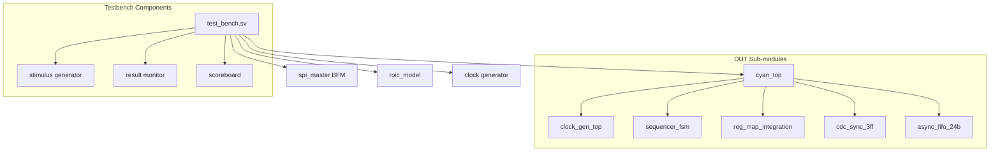

# CYAN-FPGA Simulation Guide

**Document ID:** DOC-003
**Version:** 1.0
**Last Updated:** 2026-02-04
**Project:** CYAN-FPGA xdaq_top
**FPGA:** Xilinx Artix-7 XC7A35TFGG484-1
**Tool:** Vivado 2025.2

---

## Table of Contents

1. [Overview](#section-1-overview)
2. [Simulation Directory Structure](#section-2-simulation-directory-structure)
3. [Testbench Architecture](#section-3-testbench-architecture)
4. [Running Simulations](#section-4-running-simulations)
5. [Coverage Methodology](#section-5-coverage-methodology)
6. [Expected Results](#section-6-expected-results)
7. [Debugging Tips](#section-7-debugging-tips)
8. [Reference](#section-8-reference)

---

## Section 1: Overview

### 1.1 Purpose

This guide provides comprehensive instructions for simulating the CYAN-FPGA xdaq_top design using Xilinx Vivado Simulator and ModelSim/Questa SIM.

### 1.2 Supported Simulators

| Simulator | Version | Status | Notes |
|-----------|---------|--------|-------|
| Vivado Simulator | 2025.2 | Primary | Native Xilinx simulation |
| ModelSim/Questa | 10.0+ | Secondary | Requires library compilation |

### 1.3 Simulation Scope

The xdaq_top project includes simulations for:

- **Core Modules**: Clock generation, reset synchronization, CDC modules
- **FSM Modules**: Sequencer FSM, control FSM
- **Interface Modules**: SPI register map, ROIC gate driver
- **CDC Verification**: 3-stage synchronizer, async FIFO
- **MIPI CSI-2**: TX subsystem simulation

---

## Section 2: Simulation Directory Structure

### 2.1 Directory Layout

```
simulation/
|-- tb_src/                    # Testbench source files
|   |-- test_bench.sv          # Top-level testbench
|   |-- sequencer_fsm_tb.sv    # Sequencer FSM testbench
|   |-- sequencer_fsm_tb_refactored.sv
|   |-- tb_ctrl_fsm_sg.sv      # Control FSM testbench
|   |-- tb_reg_map.sv          # Register map testbench
|   |-- tb_roic_gate_drv_compare.sv
|   |-- spi_master.sv          # SPI master BFM
|   |-- roic_model.vhd         # ROIC behavioral model
|   |-- cdc/                   # CDC testbenches
|   |   `-- cdc_gen_sync_tb.sv # 3-stage sync testbench
|
|-- mipi_rx_sim/              # MIPI CSI-2 RX simulation
|   |-- mipi_csi2_rx/         # RX subsystem project
|   |-- coe/                  # COE memory files
|
|-- wcfg/                     # Waveform configurations
`-- logs/                     # Simulation log files
```

### 2.2 Source File Dependencies

```
tb_src/
  +-- source/hdl/cyan/         # DUT modules
  +-- source/hdl/common/       # Common modules
  +-- source/ip/               # IP simulation models
```

---

## Section 3: Testbench Architecture

### 3.1 Testbench Hierarchy



### 3.2 Testbench Components

| Component | File | Purpose |
|-----------|------|---------|
| Top-level TB | `test_bench.sv` | Full system verification |
| FSM TB | `sequencer_fsm_tb.sv` | Sequencer state machine verification |
| Control FSM TB | `tb_ctrl_fsm_sg.sv` | Control logic verification |
| Reg Map TB | `tb_reg_map.sv` | SPI register access verification |
| CDC TB | `cdc_gen_sync_tb.sv` | CDC synchronization verification |
| SPI Master | `spi_master.sv` | SPI protocol BFM |
| ROIC Model | `roic_model.vhd` | Behavioral ROIC model |

### 3.3 Bus Functional Models (BFMs)

#### SPI Master BFM

The `spi_master.sv` provides SPI master functionality for testing the `spi_slave` interface:

- **Mode**: CPOL=0, CPHA=0 (Motorola SPI Mode 0)
- **Data Width**: 8-bit
- **Commands**: Write, Read, Write-Then-Read

#### ROIC Model

The `roic_model.vhd` simulates ROIC behavior including:
- LVDS data output
- Timing relationships
- Control signal response

---

## Section 4: Running Simulations

### 4.1 Vivado Simulator

#### GUI Mode

```bash
# Launch Vivado GUI
vivado -mode gui

# In TCL Console:
cd D:/workspace/gittea-work/v2025/CYAN-FPGA/xdaq_top
open_project build/xdaq_top.xpr

# Launch simulation
launch_simulation

# Run for specified time
run 1us
```

#### Batch Mode

```tcl
# run_sim.tcl
# Create simulation script
project open build/xdaq_top.xpr

# Set simulation properties
set_property top test_bench [get_filesets sim_1]
set_property top_lib xil_defaultlib [get_filesets sim_1]

# Launch and run
launch_simulation
run all
```

```bash
# Execute from command line
vivado -mode batch -source run_sim.tcl -log sim.log
```

#### Behavioral Simulation

```bash
# Compile and simulate behavioral model
cd build/xdaq_top.xpr

# Using XSim
xvlog --prj project.tcl
xelab -debug typical test_bench glbl
xsim test_bench -gui
```

### 4.2 ModelSim/Questa

#### Library Compilation

```bash
# Compile Xilinx libraries
cd D:/AMDDesignTools/2025.2/Vivado/data/verilog/src
unisimsCompile.bat
simprimCompile.bat

# Compile project files
vlog -work work ../source/hdl/cyan/*.sv
vlog -work work ../simulation/tb_src/*.sv
vlog -work work ../source/hdl/common/*.sv
```

#### Simulation

```bash
# Optimize and elaborate
vsim -c test_bench -L unisim -L simprim

# Run simulation
run -all
```

### 4.3 Simulation Scripts

#### Sequencer FSM Test

```tcl
# run_fsm_sim.tcl
cd D:/workspace/gittea-work/v2025/CYAN-FPGA/xdaq_top

# Create project if needed
if {![file exists build/xdaq_top.xpr]} {
    create_project xdaq_top build -part xc7a35tfgg484-1
}

# Add source files
add_files -norecurse {
    source/hdl/cyan/sequencer_fsm.sv
    source/hdl/cyan/seq_lut.sv
    source/hdl/common/reset_sync.sv
}

# Add testbench
add_files -fileset sim_1 -norecurse simulation/tb_src/sequencer_fsm_tb.sv

# Set top
set_property top sequencer_fsm_tb [get_filesets sim_1]
launch_simulation
run 500us
```

---

## Section 5: Coverage Methodology

### 5.1 Coverage Types

#### Code Coverage

| Coverage Type | Tool Metric | Target |
|---------------|-------------|--------|
| Line Coverage | Statement | 100% |
| Branch Coverage | Conditional | 95% |
| Toggle Coverage | Signal | 90% |
| FSM Coverage | State/Transition | 100% |

#### Functional Coverage

Testbench-defined functional coverage points:

1. **FSM States**: All states visited
2. **State Transitions**: All valid transitions
3. **CDC Paths**: All domain crossings verified
4. **Register Access**: All registers R/W
5. **MIPI Modes**: All lane configurations

### 5.2 Coverage Collection

#### Vivado Simulator

```tcl
# Enable code coverage
set_property -name {xsim.simulate.log_all_signals} -value {true} -objects [get_filesets sim_1]
set_property -name {xsim.compile.enable_line_debug} -value {true} -objects [get_filesets sim_1]

# After simulation
open_run snapshot
report_coverage -file coverage.rpt
```

#### Coverage Database

```
simulation/
|-- coverage/
|   |-- cov_database/       # Coverage data
|   `-- reports/
|       |-- cov_summary.rpt
|       |-- cov_detail.rpt
|       `-- cov_missing.rpt
```

### 5.3 Coverage Goals by Module

| Module | Line | Branch | FSM | Toggle |
|--------|------|--------|-----|--------|
| clock_gen_top | 100% | 100% | N/A | 90% |
| sequencer_fsm | 100% | 95% | 100% | 85% |
| cdc_sync_3ff | 100% | 100% | N/A | 95% |
| async_fifo_24b | 100% | 90% | N/A | 80% |
| reg_map_integration | 95% | 90% | N/A | 85% |

---

## Section 6: Expected Results

### 6.1 Sequencer FSM Testbench

#### Test Cases

| Test | Description | Expected Result |
|------|-------------|-----------------|
| Reset | Apply reset | FSM goes to RST state |
| Normal Mode | acq_mode=3'd0 | Execute sequence 0x00-0x1F |
| AED Mode | acq_mode=3'd4 | Execute sequence 0x80-0x9F |
| Simulation Mode | acq_mode=3'd6 | Execute single sequence |
| Exit Signal | Assert exit_signal | Complete current command |

#### Expected Waveforms

- **State transitions**: RST -> PANEL_STABLE -> BACK_BIAS -> FLUSH -> EXPOSE_TIME -> READOUT -> IDLE
- **LUT access**: Correct address sequence based on mode
- **Command outputs**: Enable signals match current state
- **sequence_done**: Asserted when sequence completes

### 6.2 CDC Testbench

#### Test Cases

| Test | Description | Expected Result |
|------|-------------|-----------------|
| Basic Sync | Toggle async input | 3-cycle delay to output |
| Pulse Rejection | <3 cycle pulse | May be captured (level-sensitive) |
| Reset | Assert reset | Output clears to RESET_VAL |
| Continuous | Continuous signal | Stable output after 3 cycles |

#### Expected Timing

```
Source clock (20MHz): Period = 50ns
Dest clock (200MHz): Period = 5ns

CDC delay: 3 x dest_clock_period = 15ns (typical)
MTBF: >100 years (for 3-stage synchronizer)
```

### 6.3 Async FIFO Testbench

#### Test Cases

| Test | Description | Expected Result |
|------|-------------|-----------------|
| Write/Read | Single write/read | Data matches after CDC |
| Full Detection | Fill FIFO | Full asserts correctly |
| Empty Detection | Drain FIFO | Empty asserts correctly |
| Concurrent | Simultaneous R/W | No data corruption |

### 6.4 Success Criteria

A simulation is considered successful when:

1. **No X/Z states**: All signals resolve to 0 or 1
2. **No timeouts**: All wait conditions complete
3. **No assertion failures**: All check tasks pass
4. **Coverage meets target**: Line coverage >95%
5. **Waveforms match spec**: Timing relationships verified

---

## Section 7: Debugging Tips

### 7.1 Common Issues

#### Issue 1: Simulation Won't Start

**Symptoms**: `ERROR: [XSIM 43-XXXX]`

**Solutions**:
```tcl
# Check file order
update_compile_order -fileset sim_1

# Re-compile files
reset_project
export_simulation
```

#### Issue 2: X Propagation

**Symptoms**: Signals showing 'X' or 'Z'

**Debug Steps**:
1. Check reset polarity (active-LOW vs active-HIGH)
2. Verify all inputs are driven
3. Check for multiple drivers on same signal
4. Verify clock generation

```systemverilog
// Add debug code
$display("Time=%0t, reset=%b, clk=%b, state=%h", $time, rst_n, clk, state);
```

#### Issue 3: Timing Violations in Simulation

**Symptoms**: Setup/hold violations in log

**Solutions**:
- For behavioral simulation, ignore timing (no delays)
- For timing simulation, check clock constraints
- Verify CDC synchronizer usage

#### Issue 4: FSM Stuck in Wrong State

**Debug Steps**:
```systemverilog
// Add state monitor
always @(posedge clk) begin
    $display("Time=%0t: State=%s, Next=%s",
             $time,
             state_to_str(current_state),
             state_to_str(next_state));
end
```

### 7.2 Waveform Analysis

#### Key Signals to Monitor

**Clock Domains**:
- `s_clk_20mhz` - FSM clock
- `s_clk_100mhz` - System clock
- `s_dphy_clk_200M` - DPHY clock

**Resets**:
- `nRST` - External reset
- `rst_n_20mhz` - 20MHz domain reset
- `rst_n_100mhz` - 100MHz domain reset
- `rst_n_200mhz` - 200MHz domain reset

**FSM**:
- `current_state_o` - Current FSM state
- `sequence_done_o` - Sequence complete flag
- `busy_o` - FSM busy flag

**CDC**:
- `din` / `dout` - Synchronizer I/O
- `full` / `empty` - FIFO flags

### 7.3 Debug Tasks

#### State Logging

```systemverilog
task automatic log_state();
    $display("[%0t] State: %s, Repeat: %0d, Length: %0d",
             $time,
             state_to_str(current_state_o),
             current_repeat_count_o,
             current_data_length_o);
endtask
```

#### Memory Dump

```systemverilog
task automatic dump_lut();
    $display("LUT RAM Contents:");
    for (int i = 0; i < 256; i++) begin
        $display("LUT[%02d] = %h", i, dut.lut_memory[i]);
    end
endtask
```

### 7.4 Advanced Debugging

#### Waveform Configuration Files

Create `simulation/wcfg/debug.wcfg`:

```tcl
# Preferred signals for debugging
add_wave /testbench/dut/current_state_o
add_wave /testbench/dut/sequence_done_o
add_wave /testbench/dut/rst_n_20mhz
add_wave /testbench/dut/s_clk_20mhz

# Log all signals
log_wave -r *
```

---

## Section 8: Reference

### 8.1 Related Documents

| Document | Location | Description |
|----------|----------|-------------|
| TECHNICAL_REFERENCE.md | doc/ | Complete technical reference |
| TIMING_GUIDE.md | doc/ | Timing constraints guide |
| README.md | root | Project overview |

### 8.2 Module References

- `clock_gen_top.sv` - Clock generation and reset sync
- `cdc_sync_3ff.sv` - 3-stage CDC synchronizer
- `async_fifo_24b.sv` - Async FIFO for MIPI data
- `sequencer_fsm.sv` - Main acquisition sequencer
- `reg_map_integration.sv` - SPI register interface

### 8.3 Command Reference

```bash
# Vivado simulation commands
vivado -mode gui                    # GUI mode
vivado -mode batch -source <file>   # Batch mode
xvlog <options> <files>             # Compile
xelab <options> <top>               # Elaborate
xsim <top> [options]                # Simulate

# ModelSim commands
vlog <options> <files>              # Compile
vsim <options> <top>                # Simulate
```

### 8.4 File Locations

| Type | Location |
|------|----------|
| Source RTL | `source/hdl/cyan/` |
| Common RTL | `source/hdl/common/` |
| Testbenches | `simulation/tb_src/` |
| IP Cores | `source/ip/` |
| COE Files | `simulation/mipi_rx_sim/coe/` |

---

**End of Document: DOC-003**
