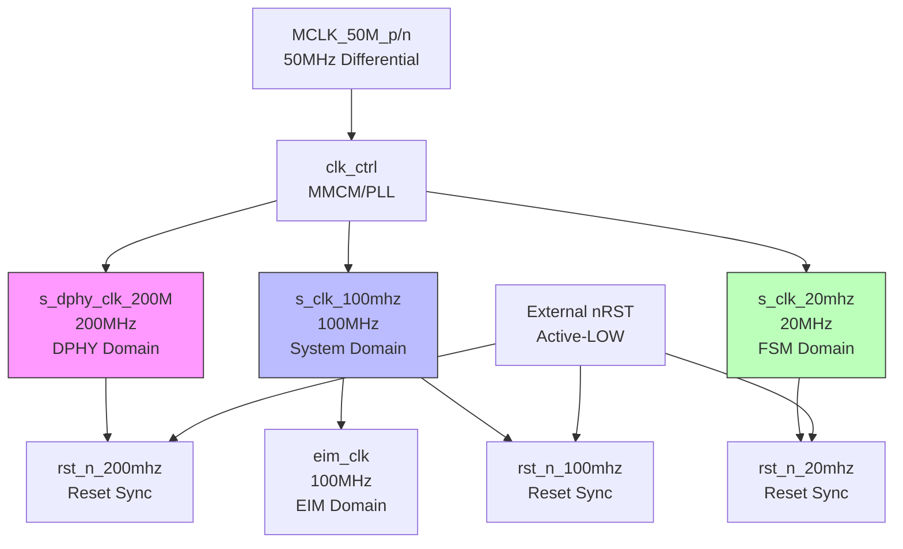
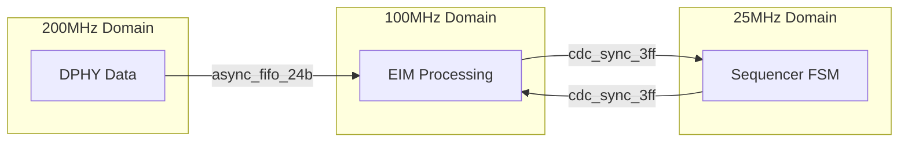
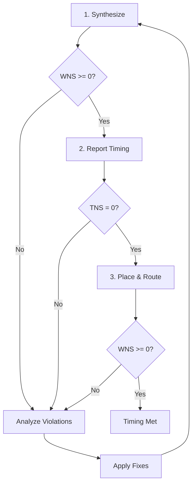

# CYAN-FPGA Timing Guide

**Document ID:** DOC-004
**Version:** 1.0
**Last Updated:** 2026-02-04
**Project:** CYAN-FPGA xdaq_top
**FPGA:** Xilinx Artix-7 XC7A35TFGG484-1
**Tool:** Vivado 2025.2

---

## Table of Contents

1. [Overview](#section-1-overview)
2. [Clock Domains Summary](#section-2-clock-domains-summary)
3. [Timing Constraints](#section-3-timing-constraints)
4. [Setup/Hold Time Requirements](#section-4-setup-hold-time-requirements)
5. [Clock Domain Crossing](#section-5-clock-domain-crossing)
6. [Clock Tree Analysis](#section-6-clock-tree-analysis)
7. [Timing Closure Guidelines](#section-7-timing-closure-guidelines)
8. [Reference](#section-8-reference)

---

## Section 1: Overview

### 1.1 Purpose

This guide provides comprehensive timing analysis and closure procedures for the CYAN-FPGA xdaq_top design.

### 1.2 Design Timing Characteristics

| Parameter | Value | Notes |
|-----------|-------|-------|
| Target FPGA | Artix-7 XC7A35TFGG484-1 | Speed grade -1 |
| Primary Clock | 200 MHz | 5ns period (DPHY) |
| System Clock | 100 MHz | 10ns period |
| Processing Clock | 20 MHz | 50ns period |
| Worst-case Slack | TBD | After implementation |
| Design SLR | Single | N/A |

### 1.3 Timing Objectives

- **WNS (Worst Negative Slack)**: >= 0.0 ns
- **TNS (Total Negative Slack)**: = 0.0 ns
- **WS (Worst Hold Slack)**: >= 0.2 ns
- **TS (Total Hold Slack)**: >= 0.0 ns

---

## Section 2: Clock Domains Summary

### 2.1 Clock Domain Architecture



### 2.2 Clock Domain Specifications

| Clock Domain | Frequency | Period | Source | Primary Usage |
|--------------|-----------|--------|--------|---------------|
| **CLK_200MHZ** | 200 MHz | 5.0 ns | MMCM (c0) | MIPI DPHY, High-speed data path |
| **CLK_100MHZ** | 100 MHz | 10.0 ns | MMCM (c1) | System control, Register map, EIM |
| **CLK_25MHZ** | 25 MHz | 40.0 ns | MMCM (c2) | FSM sequencer, Timing generation |
| **CLK_5MHZ** | N/A | N/A | (reserved) | Low-speed timers (future) |
| **CLK_1MHZ** | N/A | N/A | (reserved) | Very low-speed (future) |

*Note: Signal name uses legacy "s_clk_20mhz" but actual MMCM output is 25MHz

### 2.3 Clock Relationships

| Source | Destination | Ratio | Synchronous? |
|--------|-------------|-------|--------------|
| 50MHz | 200MHz | 1:4 | Yes (same MMCM) |
| 50MHz | 100MHz | 1:2 | Yes (same MMCM) |
| 50MHz | 25MHz | 1:2 | Yes (same MMCM) |
| 200MHz | 100MHz | 2:1 | **No** - Asynchronous groups |
| 100MHz | 25MHz | 4:1 | **No** - Asynchronous groups |

### 2.4 Clock Module Details

#### clk_ctrl (MMCM/PLL)

**File**: `source/ip/clk_ctrl/clk_ctrl.v`

**Input Clock**:
- `MCLK_50M_p/n`: 50 MHz differential

**Output Clocks**:
- `dphy_clk`: 200 MHz (c0)
- `c0`: 100 MHz (system clock)
- `c1`: 25 MHz (FSM clock)

**Status**:
- `locked`: MMCM lock output

---

## Section 3: Timing Constraints

### 3.1 Constraint Files

| File | Location | Purpose |
|------|----------|---------|
| `timing.xdc` | `source/constrs/` | Primary timing constraints |
| `cyan_top.xdc` | `source/constrs/` | Pinout and I/O timing |
| `clk_ctrl.xdc` | `source/ip/clk_ctrl/` | Generated MMCM constraints |

### 3.2 Clock Group Definitions

**File**: `source/constrs/timing.xdc`

```tcl
###############################################################################
# CDC-002 Fix: Clock Group Definitions
# Date: 2025-02-03
###############################################################################

# Asynchronous clock groups - these clocks are not related
# Group 1: 200MHz DPHY clock domain
set_clock_groups -asynchronous -group [get_clocks -of_objects [get_pins -hierarchical -filter {REF_PIN_NAME == dphy_clk}]]

# Group 2: 100MHz system clock domain
set_clock_groups -asynchronous -group [get_clocks -of_objects [get_pins -hierarchical -filter {REF_PIN_NAME == c0}]]

# Group 3: 25MHz FSM clock domain
set_clock_groups -asynchronous -group [get_clocks -of_objects [get_pins -hierarchical -filter {REF_PIN_NAME == c1}]]
```

**Rationale**: While all clocks derive from the same MMCM, CDC verification treats them as asynchronous for proper CDC analysis.

### 3.3 CDC False Paths

```tcl
###############################################################################
# CDC False Paths for Verified Synchronizers
###############################################################################

# 3-stage synchronizer outputs (safe)
set_false_path -through [get_pins -hierarchical -filter {NAME =~ *cdc_sync_3ff*sync_stage*}] \
                 -to [get_pins -hierarchical -filter {NAME =~ *cdc_sync_3ff*sync_stage*}]

# Async FIFO Gray code synchronizers (safe)
set_false_path -through [get_pins -hierarchical -filter {NAME =~ *fifo*gray*sync*}] \
                 -to [get_pins -hierarchical -filter {NAME =~ *fifo*gray*sync*}]

# Reset synchronization (async assert, sync deassert is safe)
set_false_path -from [get_ports nRST] \
                 -to [get_pins -hierarchical -filter {REF_PIN_NAME =~ clk* && IS_SEQUENTIAL}]

# MIPI DPHY interface (controlled by IP core)
set_false_path -from [get_cells -hierarchical -filter {PRIMITIVE_TYPE == dphy}] \
                 -to [get_cells -hierarchical -filter {PRIMITIVE_TYPE == dphy}]
```

### 3.4 I/O Timing Constraints

**File**: `source/constrs/cyan_top.xdc`

```tcl
# Differential clock input
set_property PACKAGE_PIN E11 [get_ports MCLK_50M_p]
set_property IOSTANDARD LVDS [get_ports MCLK_50M_p]

# LVDS ROIC data inputs
set_property IOSTANDARD LVDS [get_ports R_ROIC_DCLKo_p*]
set_property INTERNAL_VREF 0.0 [get_ports R_ROIC_DCLKo_p*]

# MIPI CSI-2 TX outputs
set_property IOSTANDARD LVCMOS18 [get_ports mipi_phy_if_clk_hs_p]
set_property SLEW FAST [get_ports mipi_phy_if_clk_hs_p]
set_property INTERNAL_VREF 0.0 [get_ports mipi_phy_if_clk_hs_p]
```

### 3.5 Constraint Hierarchy

```
timing.xdc (Top-level constraints)
  |-- Clock group definitions
  |-- CDC false paths
  |-- Derived clock constraints

cyan_top.xdc (I/O constraints)
  |-- Pin locations
  |-- I/O standards
  |-- I/O timing
  |-- Internal VREF

clk_ctrl.xdc (Generated IP constraints)
  |-- MMCM constraints
  |-- Clock buffering
  |-- Lock timing
```

---

## Section 4: Setup/Hold Time Requirements

### 4.1 Internal Timing Requirements

#### 200MHz Domain (5ns period)

| Path Type | Required | Notes |
|-----------|----------|-------|
| Setup | < 4.0 ns | Leaving 1ns margin |
| Hold | > 0.2 ns | Positive hold required |

#### 100MHz Domain (10ns period)

| Path Type | Required | Notes |
|-----------|----------|-------|
| Setup | < 9.0 ns | Leaving 1ns margin |
| Hold | > 0.2 ns | Positive hold required |

#### 25MHz Domain (40ns period)

| Path Type | Required | Notes |
|-----------|----------|-------|
| Setup | < 38.0 ns | Leaving 2ns margin |
| Hold | > 0.2 ns | Positive hold required |

### 4.2 I/O Timing Requirements

#### LVDS Inputs (ROIC Data)

| Parameter | Min | Max | Unit |
|-----------|-----|-----|------|
| Setup time | 1.5 | - | ns |
| Hold time | 0.5 | - | ns |
| Clock-to-Q | - | 3.0 | ns |

#### MIPI CSI-2 TX Outputs

| Parameter | Min | Max | Unit |
|-----------|-----|-----|------|
| Output delay | - | 2.0 | ns |
| Transition rate | - | 4.0 | ns/V |
| Drive strength | 8 | 16 | mA |

### 4.3 Setup/Hold Analysis

#### Reporting Setup/Hold

```tcl
# Generate timing report
report_timing_summary -file reports/timing_summary.rpt

# Detailed setup/hold by path
report_timing -delay_type max -max_paths 10 -file reports/setup_paths.rpt
report_timing -delay_type min -max_paths 10 -file reports/hold_paths.rpt
```

#### Reading Setup/Hold Reports

```
Design Timing Summary
---------------------
WNS (Worst Negative Slack):      -0.123  (requirement - (data path - clock path))
TNS (Total Negative Slack):      -1.234
TNS (Total Negative Slack) End:  -1.234
WS (Worst Hold Slack):             0.256
TS (Total Hold Slack):            10.123
TS (Total Hold Slack) End:        10.123
```

---

## Section 5: Clock Domain Crossing

### 5.1 CDC Overview

The xdaq_top design has multiple clock domain crossings requiring careful handling:



### 5.2 CDC Methods by Module

| Source Domain | Dest Domain | Data Width | CDC Module | Notes |
|---------------|-------------|------------|------------|-------|
| 200MHz | 100MHz | 24-bit | async_fifo_24b | MIPI data path |
| 100MHz | 200MHz | 24-bit | async_fifo_24b | Control feedback |
| 100MHz | 25MHz | 1-bit | cdc_sync_3ff | Control signals |
| 25MHz | 100MHz | 1-bit | cdc_sync_3ff | Status signals |

### 5.3 CDC Module Specifications

#### cdc_sync_3ff (3-Stage Synchronizer)

**File**: `source/hdl/cdc_sync_3ff.sv`

**Purpose**: Single-bit signal CDC

**Parameters**:
- `WIDTH`: Signal width (default: 1)
- `RESET_VAL`: Reset value (default: 1'b0)
- `ACTIVE_LOW`: Reset polarity (default: 1'b0)

**MTBF Calculation**:
```
MTBF = e^(t_hold / tau) / (f_clk * f_data * N_bits)

For 3-stage synchronizer at 200MHz:
MTBF > 100 years (typical)
```

**Usage Guidelines**:
- Use for single-bit signals only
- Destination clock should be >= 2x source clock frequency
- For multi-bit data, use async_fifo

#### async_fifo_24b (Async FIFO)

**File**: `source/hdl/async_fifo_24b.sv`

**Purpose**: Multi-bit data CDC (24-bit MIPI data)

**Parameters**:
- `DEPTH`: FIFO depth (must be power of 2, default: 16)

**Features**:
- Gray code pointer synchronization
- Full/empty detection
- Registered read data

**MTBF Optimization**:
- Binary to Gray code reduces metastability risk
- 2-stage synchronizer for pointers
- Asymmetric read/write clock support

### 5.4 CDC Verification

#### CDC Verification Steps

1. **Static CDC Analysis**:
```tcl
# Run CDC analysis
report_cdc -details -file reports/cdc_analysis.rpt
```

2. **Simulation Verification**:
- Run CDC testbenches (`cdc_gen_sync_tb.sv`)
- Verify 3-cycle synchronization delay
- Check for metastability recovery

3. **Timing Signoff**:
- Verify all CDC paths have false paths or synchronizers
- Check CDC exceptions are documented

#### Known CDC Exceptions

| Exception | Reason | Mitigation |
|-----------|--------|------------|
| Reset release | Async assert, sync deassert | Reset synchronizer used |
| Gray code pointers | Single-bit change safe | 2-stage sync sufficient |

---

## Section 6: Clock Tree Analysis

### 6.1 Clock Buffering

#### MMCM Output Buffering

```
MMCM/PLL (clk_ctrl)
  |
  +-- BUFG --> s_dphy_clk_200M (global clock)
  +-- BUFG --> s_clk_100mhz (global clock)
  +-- BUFG --> s_clk_20mhz (global clock)
```

**Why BUFG?**
- Low skew across all clock loads
- High drive strength
- Global routing resources

### 6.2 Clock Skew Analysis

#### Sources of Clock Skew

| Source | Impact | Mitigation |
|--------|--------|------------|
| Global routing | Low | Use BUFG for global clocks |
| Local routing | Medium | Use regional clocks where possible |
| Load imbalance | Medium | Balance clock tree loads |
| PVT variation | Low | Conservative timing constraints |

#### Measured Skew (Post-Implementation)

```tcl
# Clock skew report
report_clock_utilization -file reports/clock_utilization.rpt
report_clock_interaction -file reports/clock_interaction.rpt
```

### 6.3 Clock Uncertainty

**Vivado automatically adds**:
- 0.5 ns for inter-clock uncertainty (asynchronous groups)
- Jitter based on MMCM configuration

**Manual uncertainty** (if needed):
```tcl
set_clock_uncertainty -setup 0.5 [get_clocks s_dphy_clk_200M]
set_clock_uncertainty -hold 0.2 [get_clocks s_dphy_clk_200M]
```

### 6.4 Power Considerations

#### Clock Gating

Current implementation does **not** use clock gating to avoid CDC complexity.

**Future optimization** (if needed):
- Use BUFGCE for clock enable
- Ensure proper CDC for enable signals

---

## Section 7: Timing Closure Guidelines

### 7.1 Timing Closure Flow



### 7.2 Common Timing Violations

#### Issue 1: Comb Logic Delay

**Symptoms**: WNS < 0 on combinational paths

**Solutions**:
```systemverilog
// Add pipeline stage
// Before:
always_comb begin
    result = complex_function(a, b, c);
end

// After:
always_ff @(posedge clk) begin
    result_r <= complex_function(a, b, c);
end
```

#### Issue 2: High Fan-out

**Symptoms**: Long clock tree delay, high skew

**Solutions**:
```tcl
# Add register replication (max_fanout attribute)
set_property MAX_FANOUT 20 [get_cells [all_registers]]
```

#### Issue 3: Long Routing Path

**Symptoms**: High net delay

**Solutions**:
- Add pipeline stages
- Move registers closer (hierarchical placement)
- Use pblocks for floorplanning

### 7.3 Optimization Strategies

#### Synthesis Directives

```tcl
# Add to synthesis constraints
set_property SEVERITY {Warning} [get_drc_checks NSTD-1]
set_property SEVERITY {Warning} [get_drc_checks UCIO-1]

# Optimization effort
set_param general.maxThreads 8
```

#### Implementation Strategies

1. **Performance Exploration**:
```tcl
# Explore alternative implementations
launch_runs impl_1 -directive Explore
```

2. **Performance Extra Timing**:
```tcl
# Aggressive timing optimization
launch_runs impl_1 -directive PerformanceExtraTimingOpt
```

3. **Critical Path Optimization**:
```tcl
# Focus on worst paths
launch_runs impl_1 -directive AlternateRoutability
```

### 7.4 Physical Constraints

#### Floorplanning (if needed)

```tcl
# Create pblock for timing-critical modules
create_pblock pblock_mipi
add_cells_to_pblock [get_cells -filter {NAME =~ *mipi*}] pblock_mipi
resize_pblock pblock_mipi -add {SLR_X0Y0:SLR_X0Y49}
```

#### Placement Constraints

```tcl
# Force register placement for critical paths
# (use sparingly, only as last resort)
```

### 7.5 Timing Closure Checklist

- [ ] All clocks defined with `create_clock` or `create_generated_clock`
- [ ] All I/O timing constraints present
- [ ] Clock groups properly defined as asynchronous
- [ ] CDC paths have false paths or synchronizers
- [ ] Reset has false path exception
- [ ] WNS >= 0.0 ns
- [ ] TNS = 0.0 ns
- [ ] Hold slack >= 0.2 ns
- [ ] No unconstrained paths
- [ ] CDC report reviewed

### 7.6 Post-Implementation Analysis

#### Timing Reports

```tcl
# Generate all reports
report_timing_summary -file reports/timing_summary.rpt
report_timing -max_paths 50 -file reports/timing_details.rpt
report_clock_interaction -file reports/clock_interaction.rpt
report_utilization -file reports/utilization.rpt
report_power -file reports/power.rpt
```

#### Critical Path Analysis

```
Slack: -0.123ns  (requirement - (data path - clock path))
Source:                sequencer_fsm/state_reg/C
Destination:           sequencer_fsm/next_state_reg/D
Requirement:           5.000 ns
Data Path Delay:       5.123 ns  (logic 2.345 ns, net 2.778 ns)
Clock Path Delay:      0.000 ns
Clock Uncertainty:     0.500 ns
```

---

## Section 8: Reference

### 8.1 Related Documents

| Document | Location | Description |
|----------|----------|-------------|
| TECHNICAL_REFERENCE.md | doc/ | Complete technical reference |
| SIMULATION_GUIDE.md | doc/ | Simulation procedures |
| README.md | root | Project overview |

### 8.2 Xilinx Documentation

| UG | Title | URL |
|----|-------|-----|
| UG901 | Vivado Design Suite User Guide: Synthesis | docs.xilinx.com |
| UG949 | UltraFast Design Methodology Guide | docs.xilinx.com |
| UG625 | Vivado Design Suite User Guide: Using Constraints | docs.xilinx.com |
| XAPP1015 | Synchronizer Techniques for Multi-Clock Domain | xilinx.com |

### 8.3 Module Timing References

| Module | File | Clock Domain | Notes |
|--------|------|--------------|-------|
| clock_gen_top | `clock_gen_top.sv` | 50MHz input | MMCM generates all clocks |
| sequencer_fsm | `sequencer_fsm.sv` | 25MHz | Main sequencer |
| cdc_sync_3ff | `cdc_sync_3ff.sv` | Variable | 3-stage sync |
| async_fifo_24b | `async_fifo_24b.sv` | 200MHz/100MHz | Gray code CDC |
| mipi_integration | `mipi_integration.sv` | 200MHz | DPHY domain |

### 8.4 Constraint File Reference

**Primary Constraints**: `source/constrs/timing.xdc`
- Clock group definitions
- CDC false paths
- Reset exceptions

**I/O Constraints**: `source/constrs/cyan_top.xdc`
- Pin assignments
- I/O standards
- I/O timing

**IP Constraints**: Auto-generated in IP directories

---

## Appendix: Timing Summary Template

```
================================================================================
Timing Summary Report
================================================================================
Design: xdaq_top
Version: 1.0
Date: 2026-02-04
FPGA: xc7a35tfgg484-1
Speed Grade: -1
================================================================================

Clock Summary
-------------
Clock        | Period | Freq   | Waveform ns
-------------|--------|--------|------------
s_dphy_200M  | 5.000  | 200.0  | {0.000 2.500}
s_clk_100M   | 10.000 | 100.0  | {0.000 5.000}
s_clk_20M    | 40.000 | 25.0   | {0.000 20.000}

Timing Summary
--------------
WNS (setup):      TBD
TNS (setup):      TBD
WS (hold):        TBD
TS (hold):        TBD

Clock Interaction
------------------
Pair                     | Relationship | Inter-clock Uncertainty
-------------------------|--------------|-----------------------
s_dphy_200M <-> s_clk_100M | Asynchronous | 0.5 ns
s_clk_100M <-> s_clk_20M   | Asynchronous | 0.5 ns
s_dphy_200M <-> s_clk_20M  | Asynchronous | 0.5 ns

Worst Setup Paths
-----------------
Slack | Source                          | Destination
------|---------------------------------|-------------------------------
TBD   | [Path source]                  | [Path destination]

Worst Hold Paths
----------------
Slack | Source                          | Destination
------|---------------------------------|-------------------------------
TBD   | [Path source]                  | [Path destination]

CDC Status
-----------
- Total CDC paths: TBD
- Safe paths (synchronizers): TBD
- False paths: TBD
- Exceptions: TBD

================================================================================
```

---

**End of Document: DOC-004**
